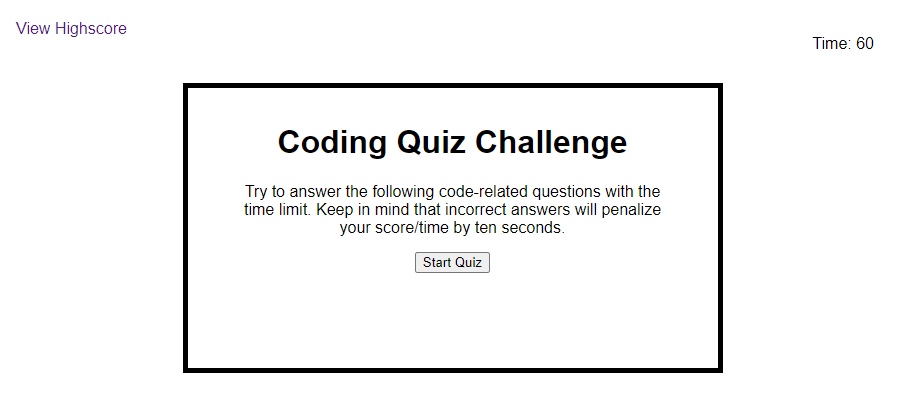

# Code Quiz

 Title
## Table of Contents
- [Description](#Description)
- [Visuals](#Visuals)
- [Link](#Link)

## Description

The Code Quiz is a short game that test your knowledge of JavaScript. The code is made of Javascript, HMTL, CSS. You click on your answer choice you think is correct and go onto the next questions. Once you are finished you are able to proceed to the next question. If you answer correctly you will be docked 10 seconds from the timer.

## Visuals

## Link
[Code Quiz](https://wparker05.github.io/code-quiz/)

